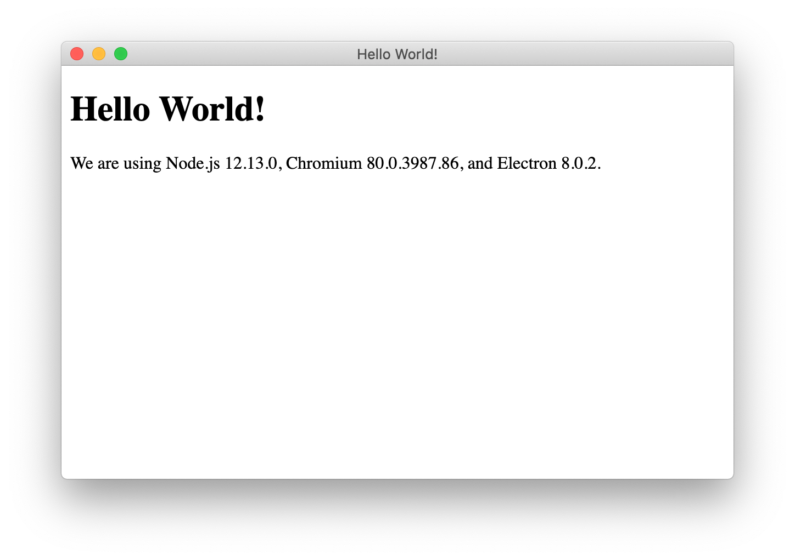
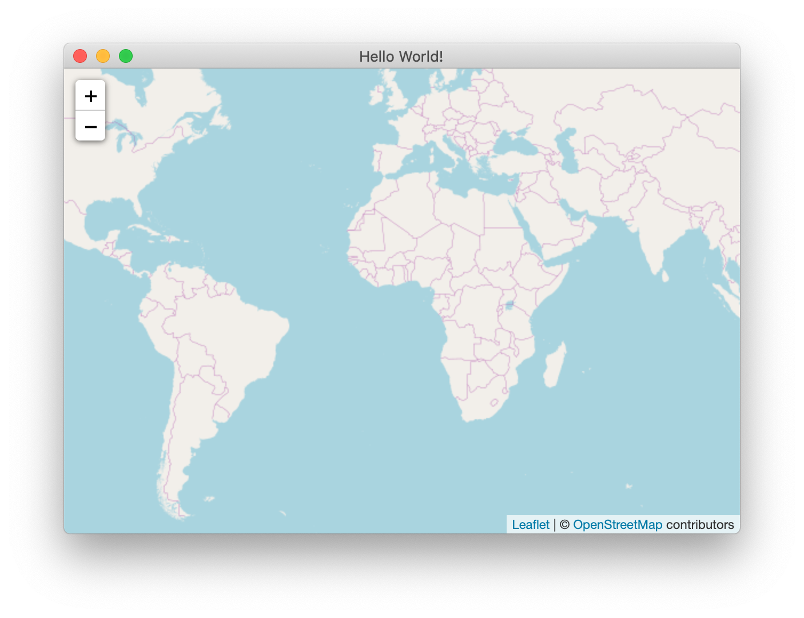
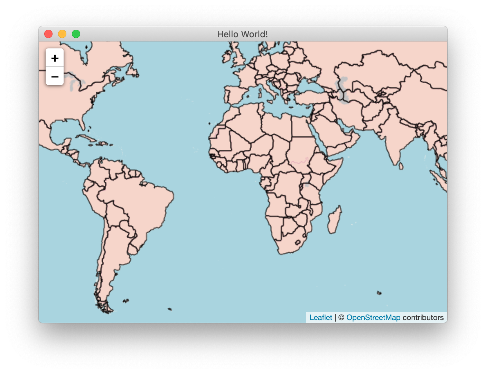
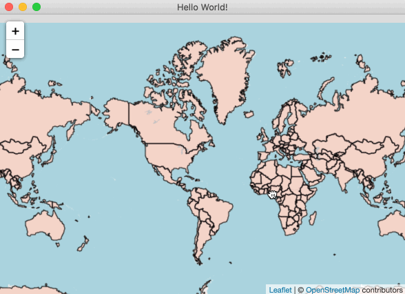

# Quick Started for Desktop
> This quick started guide assumes the [setup](GettingStarted/Setup) page is read and the environment is prepared.

## User Story
For a software development, defining the user story is the first thing. Our quick started user story is this.
> I want to kick off a mapping software for desktop, that allows to run multiple platforms including macOS, Linux and Windows. The first thing is to build an interactive map view with my world shapefile. The interactive map means that the map is capable to pan, zoom etc.

## Let's Get Started
This time, we are going to build a cross platform mapping software for desktop with web technology. `Electron` can perfectly satisfy this requirement. 

### Prepare The Project Baseline
From `electron` official guide, I think cloning the startup project is the easiest way. Follow the command below.

```bash
git clone https://github.com/electron/electron-quick-start quick-started-desktop
cd quick-started-desktop
yarn
```

At this step, we clone an `Electron` startup project and installed its dependencies. We can evaluate whether our development environment is ready.
```bash
yarn start
```

If everything is fine, we will see the basic desktop surface.



Now we will start to build our mapping software on this baseline.

### Start to Build Map

#### Install Dependencies
The first thing is still install relative dependencies. We need 3 modules.
* `ginkgoch-map`. Our map library for node.js, which provides the mapping features.
* `leaflet`. A great front end UI map library to build beautiful map on browser.
* `ginkgoch-leaflet-extensions`. A Leaflet extension that connects `Ginkgoch Map Library` and `Leaflet`.

```bash
yarn add ginkgoch-map leaflet ginkgoch-leaflet-extensions
```

#### Turn on Node Integration
Due to the startup project doesn't turn on the node integration, we need to manually turn it on. Open `main.js` and add `nodeIntegration: true` to the `webPreferences` node.
```javascript
webPreferences: {
    + nodeIntegration: true,
    preload: path.join(__dirname, 'preload.js')
}
```

#### Implement Client Code
Open index.html which is the place to layout your map software client interface.
```html
<!DOCTYPE html>
<html>
  <head>
    <meta charset="UTF-8">
    <title>Hello World!</title>
    <link rel="stylesheet" href="./node_modules/leaflet/dist/leaflet.css">
    <style> html, body, #mapApp { margin: 0px; width: 100%; height: 100%; } </style>
  </head>
  <body>
    <div id="mapApp"></div>
    <script src="./renderer.js"></script>
  </body>
</html>
```

#### Add Initial Map Code
Open file `renderer.js` which is your main working file.
```javascript
const L = require('leaflet');

function main() {
    let map = L.map('mapApp').setView([0, 0], 2);
    L.tileLayer('https://{s}.tile.openstreetmap.org/{z}/{x}/{y}.png', {
        attribution: '&copy; <a href="https://www.openstreetmap.org/copyright">OpenStreetMap</a> contributors'
    }).addTo(map);

    addWorldLayer();
}

function addWorldLayer() {
    // we will fill this block soon for rendering your local shapefile
}

main();
```
Now let's `yarn start` to take a look at the effect.


#### Add a New Layer for Your Local Shapefile
Don't close this running process. Let's keep working on the `renderer.js` and implement the `addWorldLayer` function for rendering shapefile on your local machine.

```javascript
function addWorldLayer(map) {
    let featureSource = new G.ShapefileFeatureSource(path.resolve(__dirname, '../data/cntry02.shp')); // replace the file path to your own location
    let featureLayer = new G.FeatureLayer(featureSource);
    featureLayer.styles.push(new G.FillStyle('rgba(255, 153, 128, 0.3)', 'black', 1));
    
    const worldLayer = L.gridLayer.features();
    worldLayer.pushLayer(featureLayer);
    worldLayer.addTo(map);
}
```

Save file and switch to the desktop window. Press `cmd+r` to refresh, you will see the shapefile overlaps on the base map.



#### Summary
We can add more powerful features on the map, but we will stop here. I don't want to make the quick started demo complex. The purpose is to quickly start your mapping software development. We will introduce more map functions later.




