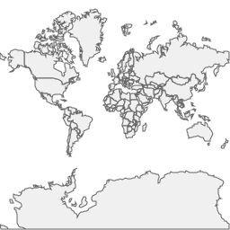
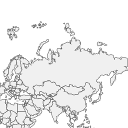

# Quick Started for Web Services
> This quick started guide assumes the [setup](GettingStarted/Setup) page is read and the environment is prepared.

## User Story
For a software development, defining the user story is the first thing. Our quick started user story is this.
> I want to kick off a web map software for browser. The client library such as Leaflet is not capable to use my own data, while the other map server library is expensive or heavy or maybe not easy to deployment on various OS. Thus, I want to firstly build my own mapping server for my personal business. And then work with map UI library such as Leaflet to make it to represent on browser. I also want it easy to deployment.

## Let's Get Started
There are many easy to use web framework to build a web service. To make this quick start guide simple, we will use `Ginkgoch Map Library` and `Plain JavaScript` to build this first map service.

### Prepare The Project Baseline
Make sure the [Setup for Service Specific](GettingStarted/Setup) is read and installed the necessary dependencies.

```bash
mkdir quick-started-service
cd quick-started-service
yarn init -y
yarn add ginkgoch-map canvas
touch index.js
code .
```

After those commands are executed, we already setup our project base line: created a project folder, init the dependency management config file, installed the necessary modules, created a service entry point file and open visual studio code as our later IDE. Now we are ready to code.

### Start to Build Map Service

#### Create a Simple HTTP Server
Fill the following code into `index.js` and that's done.
```javascript
const http = require('http');
const port = 5500;

function serve() {
    const server = http.createServer((req, res) => {
        // here is the mapping code area
    });

    server.listen(port, () => {
        console.log(`Server is served at http://localhost:${port}`);
    });
}

serve();
```

Execute `node index.js`, a HTTP server will be hosted at `http://localhost:5500`.

#### Add Tiled Map Route
Refer to this [wiki page](https://en.wikipedia.org/wiki/Tiled_web_map) for more detail of `tiled map server`. We are going to implement one of its standard `XYZ` tile to implement it. We assume our XYZ tile route URL is `/maps/default/{z}/{x}/{y}`. I think this route could be RESTful and easy to extend the resources later. Let's move on.

```javascript
const http = require('http');
const path = require('path');
const G = require('ginkgoch-map').default.all;

// register native graphics and it is the most important one
require('ginkgoch-map/native/node').init();

const port = 5500;
function serve() {
    const server = http.createServer(async (req, res) => {
        // parse the route: /maps/default/{z}/{x}/{y}
        if (req.url.match(/maps\/default(\/\d+){3}/)) {
            // parse x, y, z from url
            let segments = req.url.split('/');
            let [z, x, y] = segments.slice(segments.length - 3);

            // draw tile image
            let tileImage = await getTileImage(x, y, z);

            // write respond
            res.writeHead(200, {'Content-Type': 'image/png'});
            res.end(tileImage);
        } 
        else {
            console.debug(`URL not handled: ${req.url}`);
        }
    });

    server.listen(port, () => {
        console.log(`Server is served at http://localhost:${port}`);
    });
}

serve();
```

Here pastes the `getTileImage` function separately for extending the mapping functions later.
```javascript
async function getTileImage(x, y, z) {
    let sourcePath = path.resolve(__dirname, `../data/cntry02.shp`);
    let source = new G.ShapefileFeatureSource(sourcePath);
    let layer = new G.FeatureLayer(source);
    layer.styles.push(new G.FillStyle('#f0f0f0', '#636363', 1));
    let mapEngine = new G.MapEngine(256, 256);
    mapEngine.pushLayer(layer);

    let mapImage = await mapEngine.xyz(x, y, z);
    return mapImage.toBuffer();
}
```

Let's restart our server by `node index.js` again. Visit `http://localhost:5500/maps/default/0/0/0` will response a world wide image with countries.



Try another url for one level down `http://localhost:5500/maps/default/1/1/0`.



## Summary
In this page, we create a tiled map service with `Ginkgoch Map Library` and `Plain JavaScript`. It seems pretty much code, but it is from 0 to 1 to walk you through the entire process. Later, we will introduce advanced way to make the project modern and fancy. Until next time.