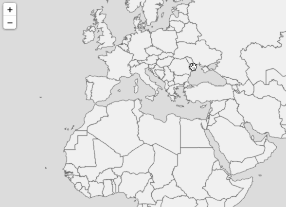
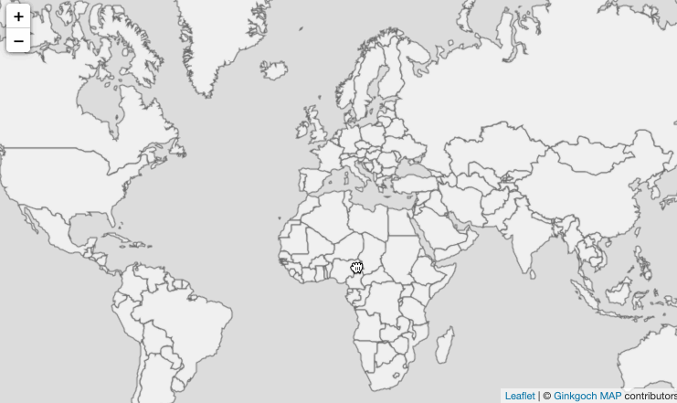

# Quick Started for Web
> This quick started guide assumes the [setup](GettingStarted/Setup) page is read and the environment is prepared.
> The complete source code is in [github](https://github.com/ginkgoch/node-map-quickstart/tree/master/quick-started-web).

In the previous [quick start guide for service](GettingStarted/Service), we setup a tiled map service by accessing map tiles by XYZ standard. This guide, we will continue working on this project to add client code to build an interactive map.

## User Story
For a software development, defining the user story is the first thing. Our quick started user story is this.
> I need a B/S map software with a map that can pan, zoom and allows to show me the detail information where I clicked.

## Let's Get Started
A web application could be two ways. one is completely backend and frontend separated (e.g. client + RESTful); another one is to to render the HTML pages on the server part (e.g. express.js + templates). In this guide, I will use the former one. For we could reuse our existing services, and our project could be cleaner structural.

### Prepare The Project Baseline
Let's prepare the project baseline. Assume our [previous quick start for service](GettingStarted/Service) is completed and folder name is `quick-started-service`. We will reuse the code in this project.

```bash
# copy the previous project as our current quick start project baseline
cp -r quick-started-service quick-started-web
cd quick-started-web
yarn
code .
```

Now, we have the project baseline and opened this project with `visual studio code`.

### Build an Initial Map View
Create a folder `client` and a file `index.html` inside.

Install `Leaflet` as our map UI component.
```
yarn add leaflet
```

Paste the html code into `client/index.html`.
```html
<!DOCTYPE html>
<html>
  <head>
    <meta charset="UTF-8">
    <title>Hello World!</title>
    <link rel="stylesheet" href="../node_modules/leaflet/dist/leaflet.css">
    <style> html, body, #mapApp { margin: 0px; width: 100%; height: 100%; } </style>
  </head>
  <body>
    <div id="mapApp"></div>
    <script src="../node_modules/leaflet/dist/leaflet.js"></script>
    <script>
        let map = L.map('mapApp').setView([0, 0], 2);
        L.tileLayer('http://localhost:5500/maps/default/{z}/{x}/{y}', {
            attribution: '&copy; <a href="https://ginkgoch.com">Ginkgoch MAP</a> contributors'
        }).addTo(map);
    </script>
  </body>
</html>
```

NOTE: this is also from `Leaflet` quick start tutorial with the map service URL replaced, `http://localhost:5500/maps/default/{z}/{x}/{y}`. The attribution is replaced as well 😎.

Now we can launch our server by `node index.js` and drag the `client/index.html` into browser. An initial map view will be represented in front of you.



### Refactor the Code for More APIs
Now, we are going to add more APIs (e.g. `identify`) on this HTTP server. Let's refactor the code as following.

Basically, three changes are straight forward.
1. Extract a function to get the `MapEngine` instance.
2. Extract a function for serving XYZ tile service.
3. Handle the route handlers in a loop.

> Don't be afraid to refactor, it seems more code, but it also makes it extensible and re-usable, less code for future features.

```javascript
const http = require('http');
const path = require('path');
const G = require('ginkgoch-map').default.all;

// register native graphics and it is the most important one
require('ginkgoch-map/native/node').init();

const port = 5500;
function serve() {
    const server = http.createServer(async (req, res) => {
        let handled = false;
        // handle the route handlers in a loop.
        let routeHandlers = [handleTileRoute]; // new route handlers will be added in this array later
        for (let routeHandler of routeHandlers) {
            handled = await routeHandler(req, res);
            if (handled) {
                break;
            }
        }

        if (!handled) {
            console.debug(`URL not handled: ${req.url}`);
        }
    });

    server.listen(port, () => {
        console.log(`Server is served at http://localhost:${port}`);
    });
}

async function getTileImage(x, y, z) {
    let mapEngine = getMap();
    let mapImage = await mapEngine.xyz(x, y, z);
    return mapImage.toBuffer();
}

// extract a function to get the `MapEngine` instance.
function getMap() {
    let sourcePath = path.resolve(__dirname, `../data/cntry02.shp`);
    let source = new G.ShapefileFeatureSource(sourcePath);
    let layer = new G.FeatureLayer(source);
    layer.styles.push(new G.FillStyle('#f0f0f0', '#636363', 1));
    let mapEngine = new G.MapEngine(256, 256);
    mapEngine.pushLayer(layer);
    return mapEngine;
}

// extract a function for serving XYZ tile service.
async function handleTileRoute(req, res) {
    let handled = false;

    // parse the route: /maps/default/{z}/{x}/{y}
    if (req.url.match(/maps\/default(\/\d+){3}/)) {
        // parse x, y, z from url
        let segments = req.url.split('/');
        let [z, x, y] = segments.slice(segments.length - 3);

        // draw tile image
        let tileImage = await getTileImage(x, y, z);

        // write respond
        res.writeHead(200, {'Content-Type': 'image/png'});
        res.end(tileImage);
        handled = true;
    }
    
    return handled;
}

serve();
```

### Identify Features RESTful API
`Identify` allows to find regions of a map within a specified distance of one or more features. It is a basic spatial analysis operation.

Assume our new API is `GET: /maps/default/{layerName}/query` also the clicked information is included in query string. e.g. `GET: /maps/default/{layerName}/query?lat=0&lng+0&zoom=0` will find the features around longitude 0, latitude 0 under zoom level 0 (of course there is no features around there).

Refer the following code for the identifying.
```javascript
// handle the identify route
async function handleIdentifyRoute(req, res) {
    let handled = false;

    // parse the route: /maps/default/{layerName}/query
    if (req.url.match(/maps\/default\/\w+\/query/ig)) {
        let parameters = parseIdentifyParameters(req);
        let features = await getIdentifyFeatures(parameters);
        let featureCollection = new G.FeatureCollection(features)
        res.end(JSON.stringify(featureCollection.toJSON()));
        handled = true;
    }

    return handled;
}

async function getIdentifyFeatures(parameters) {
    let projection = new G.Projection('WGS84', 'EPSG:3857');
    let clickedPoint = new G.Point(parameters.lng, parameters.lat);
    clickedPoint = projection.forward(clickedPoint);

    let mapEngine = getMap();
    let layer = mapEngine.layer('cntry02');
    if (layer === undefined) {
        return [];
    }

    await layer.open();
    let features = await layer.source.query('intersection', clickedPoint);
    features.forEach(f => f.geometry = projection.inverse(f.geometry));
    return features;
}

function parseIdentifyParameters(req) {
    let queryStringStarts = req.url.lastIndexOf('?');
    let lat = undefined, lng = undefined, zoom = undefined;
    if (queryStringStarts !== -1) {
        let queryString = req.url.slice(queryStringStarts + 1);
        queryString.split('&').map(s => s.split('=')).forEach(s => {
            switch (s[0].toLowerCase()) {
                case 'lat': lat = parseFloat(s[1]); break;
                case 'lng': lng = parseFloat(s[1]); break;
                case 'zoom': zoom = parseInt(s[1]); break;
            }
        });
    }

    let url = req.url.slice(0, queryStringStarts);
    let segments = url.split('/');
    let layer = segments[segments.length - 2];

    return { layer, lat, lng, zoom };
}
```

Don't forget to register the identifying route in the top in the `serve` function.
```javascript
let routeHandlers = [handleTileRoute, handleIdentifyRoute];
```

Try the url: http://localhost:5500/maps/default/cntry02/query?lat=30&lng=90&zoom=2 to verify the result. This responses a typical `FeatureCollection` in `GeoJSON` format.
```json
{
    "id": 0,
    "type": "FeatureCollection",
    "features": [
        {
            "id": 47,
            "type": "Feature",
            "geometry": {
                "type": "MultiPolygon",
                "coordinates": [
                    [
                        [
                            [
                                97.64997863769533,
                                23.851703643798817
                            ],
                            ...
                        ]
                    ]
                ]
            },
            "properties": {
                "FIPS_CNTRY": "CH",
                "GMI_CNTRY": "CHN",
                "ISO_2DIGIT": "CN",
                "ISO_3DIGIT": "CHN",
                "CNTRY_NAME": "China",
                "LONG_NAME": "China",
                "SOVEREIGN": "China",
                "POP_CNTRY": 1281396894,
                "CURR_TYPE": "Renminbi Yuan",
                "CURR_CODE": "CNY",
                "LANDLOCKED": "N",
                "SQKM": 9367345,
                "SQMI": 3616732,
                "COLOR_MAP": "2",
                "RECID": 47
            }
        }
    ]
}
```

Till now, our `identify` spatial analysis API is ready. Let's get back to the client code `client/index.html`.

### Identify Operation on Map
We are pretty close to the end. The last thing is about to trigger the identifying operation on map click event.

Open `client/index.html` and append the following code to the bottom:
```javascript
let onPopup = function (layer) {
    let properties = layer.feature.properties;
    let content = '<div class="popup-container"><table class="table table-sm table-striped">';
    for (let key in properties) {
        content += `<tr><td>${key}</td><td>${properties[key]}</td></tr>`;
    }
    content += '</table></div>';
    return content;
};

let style = {'color': '#ff7800', 'weight': 1, 'opacity': 0.65};
let geoJSONLayer = L.geoJSON([], { style }).bindPopup(onPopup).addTo(map);
let popup = undefined;

map.on('click', evt => {
    let {lat, lng} = evt.latlng;
    let zoom = map.getZoom();
    let url = `http://localhost:5500/maps/default/cntry02/query?lat=${lat}&lng=${lng}&zoom=${zoom}`;

    var oReq = new XMLHttpRequest();
    oReq.onreadystatechange = () => {
        if (oReq.readyState === XMLHttpRequest.DONE) {
            let geoJSON = JSON.parse(oReq.responseText);
            geoJSONLayer.clearLayers();

            if (geoJSON.features.length > 0) {
                geoJSONLayer.addData(geoJSON);
                geoJSONLayer.openPopup();
            }
        }
    };
    oReq.open("GET", url);
    oReq.send();
});
```

Open browser, refresh the `index.html` page.




