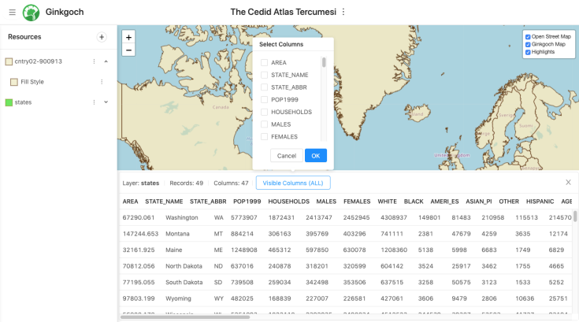

# Showcase
This page collects some highlight projects working with `Ginkgoch Map Library for Node.js`. It covers the demos, utils or apps for `command line` tools, `desktop` and `web` mapping development. All those tools or apps are capable to run on multiple platforms.

## Quick Started Projects
https://github.com/ginkgoch/node-map-quickstart

This is the project for the four step by step quick started project for map related `command line`, `desktop`, `service` and `web` mapping software.

## How Do I Feature Demos for Desktop
https://github.com/ginkgoch/map-desktop-demo

This is `Ginkgoch MAP SDK` feature demos for desktop. It includes all basic features for building a mapping software. All demos are designed as few clicks to represent what it can be done.

## Shapefile Viewer for Desktop
https://github.com/ginkgoch/node-shapefile-viewer

A desktop application for exploring shapefile information. Including header, features etc.

## Novel Coronavirus Coverage Map
https://github.com/ginkgoch/nCoV-map

A step-by-step tutorial to build a novel coronavirus map for China.

## Map RESTful Server
https://github.com/ginkgoch/node-map-server

This is a mapping service demo that allows for map visualization, querying and customization. `Docker` support.

## Shapefile Command Line Tool
https://github.com/ginkgoch/node-shapefile-cli

This is a command line tool to help to inspect a specified shapefile. It provides function to inspect a specified shapefile header, fields, records etc.

Also supports to serve this file for viewing in browser.

